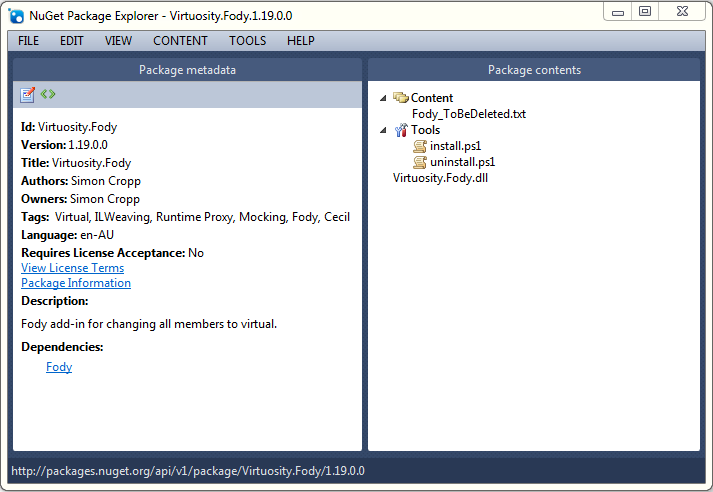

## NuGet Package 

Add-ins can be deployed through [NuGet](http://nuget.org/) packages. 

 * The package should contain one assembly in the root of the package. 
 * The name of the package and the name of the assembly should be the same and be suffixed with ".Fody". For example the [Virtuosity nuget package](https://nuget.org/packages/Virtuosity.Fody/) is named `Virtuosity.Fody` and contains the assembly `Virtuosity.Fody.dll`.
 * The package should have a single dependency on **only** the [Fody nuget package](https://nuget.org/packages/Fody/).  **Do not add any other nuget dependencies as Fody does not currently support loading these files at compile time.**
 * The nuget packages is responsible for adding and removing itself from the `FodyWeavers.xml` (See [HowToWriteAnAddin](HowToWriteAnAddin)) during install and uninstall of the nuget package. See the [nuget addin templates](https://github.com/Fody/Fody/tree/master/WeaverNugetTemplates) for an example of how to achieve this 
 * If the package has no project level files you may need to hack nuget to force it treat your package as *project level*. See the [nuget addin templates](https://github.com/Fody/Fody/tree/master/WeaverNugetTemplates) for an example of how to achieve this 
 * If using nuget 2.7 or later, the install script should mark the nuget reference (in packages.config) as a *Development-Only dependency* so the Fody package dependency is not pulled into downstream projects (see http://docs.nuget.org/docs/release-notes/nuget-2.7).  See the [nuget addin templates](https://github.com/Fody/Fody/tree/master/WeaverNugetTemplates) for an example of how to achieve this

Here is the contents of the  [Virtuosity nuget package](https://nuget.org/packages/Virtuosity.Fody/)

See Also

 * [AddinSearchPaths](AddinSearchPaths)
 *  [HowToWriteAnAddin](HowToWriteAnAddin)