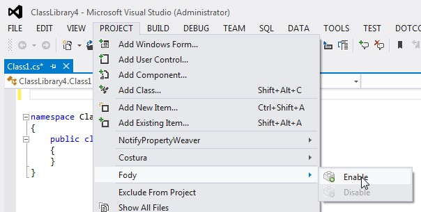

# Sample Usage

### 1. Ensure nuget is installed 

[NuGet Visual Studio package](http://visualstudiogallery.msdn.microsoft.com/27077b70-9dad-4c64-adcf-c7cf6bc9970c) (required to consume addins via nuget)

### 2. Install the Fody Visual Studio package 

[Fody Visual Studio package](http://visualstudiogallery.msdn.microsoft.com/074a2a26-d034-46f1-8fe1-0da97265eb7a) 

The Visual Studio package is only to help you configure Fody for your projects. It is not required to build on your machine or build servers.

### 3. Enable Fody for a project 

  * Open your solution Visual Studio
  * Select the project in Solution Explorer
  * Enable Fody for the project by using the top level menu 'Project > Fody > Configure'. Click OK. 
  
  
  
### 4. Add a weaver to FodyWeavers.xml
  
Notice a file `FodyWeavers.xml` has been added to the project

        <?xml version="1.0" encoding="utf-8" ?>
        <Weavers>
        </Weavers>

Now add a names weaver to this file. For this sample [Virtuosity](https://github.com/SimonCropp/Virtuosity) will be used. So the modified `FodyWeavers.xml` will look like this:

        <?xml version="1.0" encoding="utf-8" ?>
        <Weavers>
            <Virtuosity/>
        </Weavers>

### 5. Add the weaver nuget package

Install a Fody add-in using NuGet. See [Using the package manager console](http://docs.nuget.org/docs/start-here/using-the-package-manager-console) for more info. Again using Virtuosity

    `Install-Package Virtuosity.Fody`

### 6. Build

Now have a look at your assembly in your favourite decompiler. All members will now be virtual.